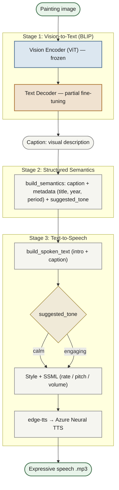

# AI-Powered Museum Navigation for the Visually Impaired

A multimodal pipeline that transforms painting images into expressive spoken descriptions for visually impaired museum visitors.

## Abstract

This project presents a multimodal pipeline that helps visually impaired museum visitors by turning a painting image into an expressive spoken description. In Stage 1 (vision-to-text), a BLIP image-captioning model fine-tuned on the Artpedia art dataset generates a visual description of the artwork. In Stage 2, the caption is enriched with optional structured metadata (title, year, art period) and an automatically chosen narration tone. In Stage 3 (text-to-speech), the enriched text is synthesized into expressive speech using edge-tts, with prosody parameters driven by the selected tone. The model's robustness is additionally evaluated zero-shot on VizWiz — photographs taken by blind people — using BLEU-4 and CIDEr as evaluation metrics.

## Architecture



## Setup

### Environment

```bash
conda create -n lavis python=3.10
conda activate lavis
```

### Clone the repository

```bash
git clone <https://github.com/GElpida/mscai-multimodal-project.git>
cd mscai-multimodal-project
```

### Install dependencies

```bash
pip install -r requirements.txt
```

Note: datasets must be installed separately with --no-deps to avoid conflicting dill/fsspec pins:

```bash
pip install datasets==2.14.6 --no-deps
```

### Running the pipeline

The pipeline is driven by two notebooks located in `notebooks/`, run from the `notebooks/` folder:

- **`01_image_to_text_finetuning_local.ipynb`** — data preparation, caption cleaning, BLIP fine-tuning, and evaluation on Artpedia and VizWiz.
- **`02_semantics_to_speech_local.ipynb`** — structured semantics generation and text-to-speech synthesis.

### Pipeline scripts (`src/`)

Listed in order of use across the pipeline:

| # | Script | Purpose |
|---|--------|---------|
| 1 | `prepare_data.py` | Download and cache Artpedia images; generate train/val/test manifests |
| 2 | `clean_captions.py` | Remove contextual (non-visual) sentences from the manifests |
| 3 | `artpedia_dataset.py` | PyTorch Dataset for Artpedia (loads records, fetches images) |
| 4 | `caption_dataset.py` | Dataset wrapper used during BLIP fine-tuning |
| 5 | `train_caption.py` | Partial fine-tuning of BLIP's text decoder on Artpedia |
| 6 | `evaluate_caption.py` | BLEU-4 and CIDEr evaluation on the Artpedia test split |
| 7 | `evaluate_vizwiz.py` | Zero-shot robustness evaluation on VizWiz-Caps |
| 8 | `tsne_compare.py` | t-SNE visualisation of pretrained vs fine-tuned representations |
| 9 | `captioner.py` | Inference wrapper around the BLIP captioner |
| 10 | `structured_semantics.py` | Enriches a caption with metadata and assigns a narration tone |

**Helper / diagnostic scripts**

| Script | Purpose |
|--------|---------|
| `sanity_check_caption.py` | Quick sanity check: runs the captioner on a single image |
| `inspect_model.py` | Prints model architecture and parameter counts |
| `inspect_decoder.py` | Inspects the text decoder layers and frozen/unfrozen state |
| `mlflow_ui.py` | Launches the MLflow tracking UI for experiment results |


## References

**Datasets**
- Stefanini et al., "Artpedia: A New Visual-Semantic Dataset with Visual and Contextual Sentences in the Artistic Domain", ICIAP 2019. *(Artpedia — training dataset)*
- Gurari et al., "Captioning Images Taken by People Who Are Blind", ECCV 2020. *(VizWiz-Captions — robustness evaluation)*

**Model & framework**
- Li et al., "BLIP: Bootstrapping Language-Image Pre-training for Unified Vision-Language Understanding and Generation", ICML 2022.
- Li et al., "LAVIS: A Library for Language-Vision Intelligence", 2022. (System Demonstrations).
- rany2, "edge-tts: Python module for Microsoft Edge's online text-to-speech service". Available: https://github.com/rany2/edge-tts

**Evaluation metrics**
- Papineni et al., "BLEU: A Method for Automatic Evaluation of Machine Translation", ACL 2002.
- Vedantam et al., "CIDEr: Consensus-Based Image Description Evaluation", CVPR 2015.